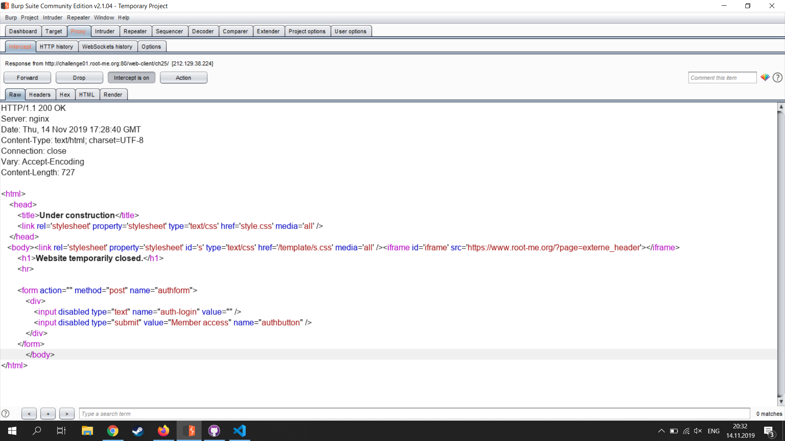
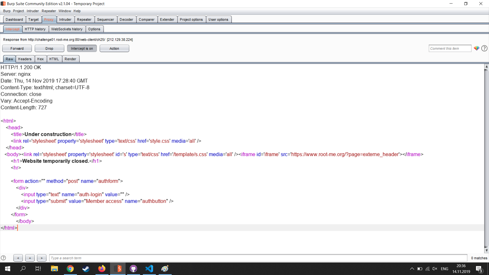

1) Перейти по адресу /web-client/ch25/
2) Увидеть, что присланная форма неактивна
3) Обновить страницу, перехватить в Burp ответ сервера на запрос

4) Модифицировать ответ сервера, активировав форму

5) Ввести в теперь активную форму произвольные данные
6) Получить в ответе сервера флаг "HTMLCantStopYou"
