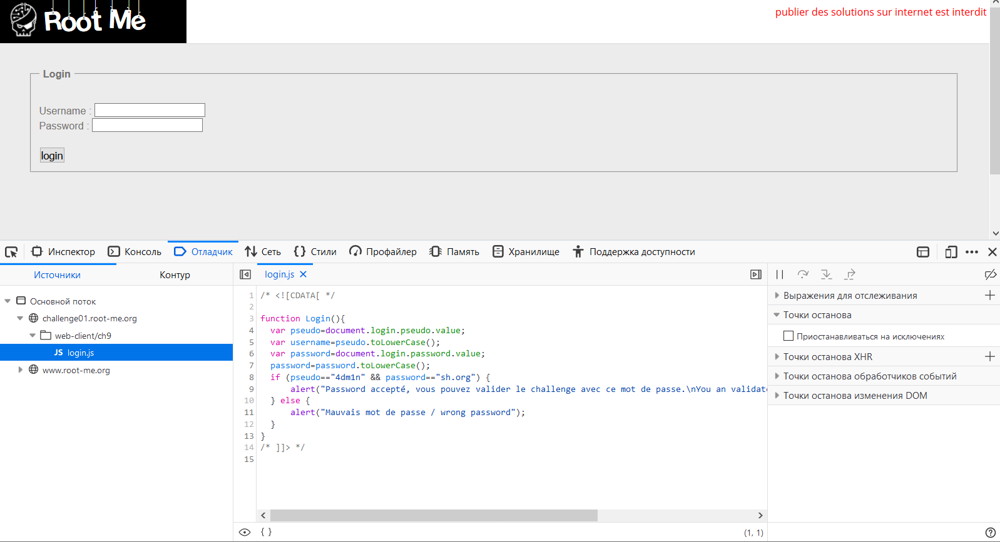

1) Перейти по адресу http://challenge01.root-me.org/web-client/ch9/
2) Увидеть, что нужно ввести логин и пароль
3) Осознать, что рандомные логин и пароль не подойдут
4) Обновить страницу и перехватить ответ сервера в Burp

5) Увидеть, что используется некий js-скрипт
6) Найти нужные логин и пароль в этом скрипте, используя инспектор в Firefox

7) Ввести их в соответствующие формы
8) Получить в ответе сервера пароль: sh.org
